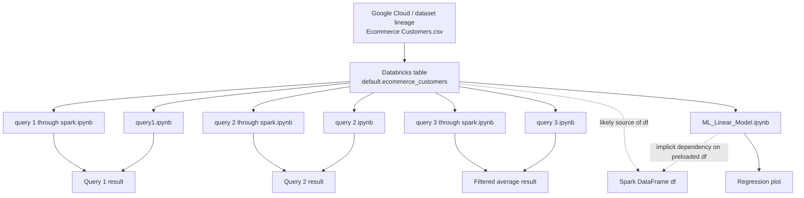

# Databricks Audit

Folder analyzed:
- [raw_databricks_exports](C:/Users/David/OneDrive/Documenti/github-sistemazione/raw_databricks_exports)

Scope:
- analysis only
- no notebook files modified
- no cleanup applied yet

## Overview

The `raw_databricks_exports/` folder contains seven very small Databricks notebook exports. They appear to be lightweight follow-ups to the Google Cloud and BigQuery project rather than a separate end-to-end Databricks pipeline.

The common pattern is:

- use the same e-commerce customer dataset already seen in the Google Cloud project
- assume a Databricks table named `default.ecommerce_customers` already exists
- re-run simple analytics queries in Spark SQL or Spark DataFrame style
- add one small regression/visualization notebook on top of the Spark-loaded data

This means the Databricks work is tightly related to the BigQuery project at the dataset level, but operationally it looks like a second execution environment rather than a direct BigQuery integration notebook set.

## Notebook-by-notebook analysis

### 1. `ML_Linear_Model.ipynb`

- Purpose:
  - exploratory regression analysis between `Length of Membership` and `Yearly Amount Spent`
  - converts Spark data into pandas and fits a linear trend line for visualization
- Spark SQL operations:
  - none
- Spark DataFrame transformations:
  - `df.filter(...)`
  - null filtering with `col(...).isNotNull()`
  - `select(...)`
  - `toPandas()`
- MLlib usage:
  - none
  - despite the name, this does not use Spark MLlib
  - regression is done with `numpy.polyfit`, not `pyspark.ml`
- Inputs:
  - implicit Spark DataFrame named `df`
  - expected columns:
    - `Length of Membership`
    - `Yearly Amount Spent`
- Outputs:
  - in-memory pandas DataFrame
  - matplotlib scatter plot with fitted line
  - no persisted file output
- Relationship with the Google Cloud / BigQuery project:
  - strong dataset-level relationship
  - likely uses the same `Ecommerce Customers` data after it was loaded into Databricks
  - no direct BigQuery API or Cloud Storage interaction
- Notes:
  - hidden dependency on a pre-existing `df`
  - not reproducible as a standalone notebook in its current form

### 2. `query 1 through spark.ipynb`

- Purpose:
  - compute average `Yearly Amount Spent` using Spark DataFrame syntax
- Spark SQL operations:
  - none explicitly through `spark.sql`
- Spark DataFrame transformations:
  - `spark.table("default.ecommerce_customers")`
  - `selectExpr("AVG(`Yearly Amount Spent`) as avg_spending")`
  - `show()`
- MLlib usage:
  - none
- Inputs:
  - Databricks table `default.ecommerce_customers`
- Outputs:
  - displayed aggregate result:
    - `avg_spending = 499.91985771641924`
- Relationship with the Google Cloud / BigQuery project:
  - same business question as BigQuery Query 1
  - effectively a Spark reimplementation of the first BigQuery aggregate
- Notes:
  - strong candidate to keep only if you want to show Spark DataFrame style alongside SQL style

### 3. `query 2 through spark.ipynb`

- Purpose:
  - compute average `Time on App` and average `Time on Website` using Spark DataFrame syntax
- Spark SQL operations:
  - none explicitly through `spark.sql`
- Spark DataFrame transformations:
  - `spark.table("default.ecommerce_customers")`
  - `selectExpr(...)`
  - `show()`
- MLlib usage:
  - none
- Inputs:
  - Databricks table `default.ecommerce_customers`
- Outputs:
  - displayed aggregate result:
    - `avg_time_on_app = 14.350284262734618`
    - `avg_time_on_website = 33.95692625943925`
- Relationship with the Google Cloud / BigQuery project:
  - same business question as BigQuery Query 2
  - Spark DataFrame version of the BigQuery aggregate comparison
- Notes:
  - compact and readable, but overlaps heavily with SQL version

### 4. `query 2.ipynb`

- Purpose:
  - compute average `Time on App` and average `Time on Website` using Databricks `%sql`
- Spark SQL operations:
  - `%sql`
  - `SELECT AVG(...) ... FROM ecommerce_customers`
- Spark DataFrame transformations:
  - none
- MLlib usage:
  - none
- Inputs:
  - table `ecommerce_customers`
- Outputs:
  - SQL result shown in notebook output
- Relationship with the Google Cloud / BigQuery project:
  - direct logical equivalent of BigQuery Query 2
  - demonstrates the same analysis in Databricks SQL style
- Notes:
  - weaker than `query 2 through spark.ipynb` if you want API variety
  - table reference omits `default.` prefix, so environment assumptions are slightly less explicit

### 5. `query 3 through spark.ipynb`

- Purpose:
  - calculate average `Yearly Amount Spent` for users with `Avg. Session Length > 34`
- Spark SQL operations:
  - none explicitly through `spark.sql`
- Spark DataFrame transformations:
  - `spark.table("default.ecommerce_customers")`
  - `filter(df["\`Avg. Session Length\`"] > 34)`
  - `agg({"Yearly Amount Spent": "avg"})`
  - `withColumnRenamed(...)`
  - `show()`
- MLlib usage:
  - none
- Inputs:
  - Databricks table `default.ecommerce_customers`
- Outputs:
  - displayed aggregate result:
    - `avg_spending_long_sessions = 545.0664955527343`
- Relationship with the Google Cloud / BigQuery project:
  - related to the same dataset, but not identical to the current cleaned BigQuery portfolio queries
  - this is a new Spark-side analytical question not present in the current GCP README set
- Notes:
  - among the strongest Spark notebooks because it shows a real filter + aggregation transformation rather than just a plain average

### 6. `query 3.ipynb`

- Purpose:
  - SQL version of the filtered average spending query for session lengths above 34
- Spark SQL operations:
  - `%sql`
  - `SELECT AVG(...) ... WHERE \`Avg. Session Length\` > 34`
- Spark DataFrame transformations:
  - none
- MLlib usage:
  - none
- Inputs:
  - `default.ecommerce_customers`
- Outputs:
  - SQL result shown in notebook output
- Relationship with the Google Cloud / BigQuery project:
  - same dataset lineage as the GCP work
  - extends the analysis with a new SQL question on customer behavior
- Notes:
  - intentionally paired with `query 3 through spark.ipynb` because the exam required both Spark SQL and Spark DataFrame/operator forms

### 7. `query1.ipynb`

- Purpose:
  - compute average `Yearly Amount Spent` by reading the table into a DataFrame, creating a temp view, and executing `spark.sql`
- Spark SQL operations:
  - `spark.sql(...)`
  - SQL aggregate over temp view `ecommerce`
- Spark DataFrame transformations:
  - `spark.read.table("default.ecommerce_customers")`
  - `createOrReplaceTempView("ecommerce")`
  - `show()`
- MLlib usage:
  - none
- Inputs:
  - Databricks table `default.ecommerce_customers`
- Outputs:
  - displayed aggregate result:
    - `avg_spending = 499.91985771641924`
- Relationship with the Google Cloud / BigQuery project:
  - same analytical question as BigQuery Query 1
  - demonstrates a hybrid Spark DataFrame plus Spark SQL approach
- Notes:
  - more instructive than `query 1 through spark.ipynb` because it shows temp-view creation and explicit SQL execution

## Cross-notebook summary

### Spark SQL operations identified

- `%sql` cell magic:
  - `query 2.ipynb`
  - `query 3.ipynb`
- `spark.sql(...)`:
  - `query1.ipynb`
- SQL-style aggregation via `selectExpr(...)`:
  - `query 1 through spark.ipynb`
  - `query 2 through spark.ipynb`

### Spark DataFrame transformations identified

- table loading:
  - `spark.table(...)`
  - `spark.read.table(...)`
- temporary view creation:
  - `createOrReplaceTempView(...)`
- filtering:
  - `filter(...)`
  - null filtering with `isNotNull()`
- projection:
  - `select(...)`
  - `selectExpr(...)`
- aggregation:
  - `agg(...)`
- column renaming:
  - `withColumnRenamed(...)`
- conversion to pandas:
  - `toPandas()`

### MLlib usage identified

- none

Despite the folder containing `ML_Linear_Model.ipynb`, there is no use of:

- `pyspark.ml`
- `pyspark.mllib`
- `VectorAssembler`
- `LinearRegression`
- `Pipeline`

The only modeling logic is local NumPy regression after converting Spark data to pandas.

## Inputs and outputs summary

### Shared inputs

Most notebooks rely on:

- Databricks table `default.ecommerce_customers`

One notebook relies on an even looser implicit input:

- `ML_Linear_Model.ipynb` expects a Spark DataFrame named `df` to already exist

### Outputs

- notebook cell display outputs only
- no durable artifacts written to files
- no Delta writes
- no CSV exports
- no model persistence

This makes the Databricks material useful as execution evidence, but weaker as a standalone repository unless paired with documentation and screenshots.

## Relationship to the Google Cloud / BigQuery project

### Direct relationships

- same core customer dataset
- same analytic theme
- Query 1 and Query 2 are Spark-side counterparts of the BigQuery queries already documented in the GCP section
- all notebooks assume the dataset has already been loaded into Databricks as `default.ecommerce_customers`

### Gaps in the relationship

- no notebook shows ingestion from BigQuery
- no notebook shows reading directly from Google Cloud Storage
- no notebook shows BigQuery connector usage
- no notebook shows synchronized output back to the Google Cloud portfolio structure

Conclusion:

These notebooks are best interpreted as a Databricks reimplementation or extension of the same coursework dataset, not as a fully documented GCP-to-Databricks pipeline.

## 1. Dependency graph

Interpretation:

- there is no explicit notebook-to-notebook chaining
- the real dependency hub is the Databricks table `default.ecommerce_customers`
- `ML_Linear_Model.ipynb` has the weakest standalone reproducibility because it depends on `df` being available before execution

## 2. Recommended repository structure

Recommended Databricks section structure:

- `databricks/README.md`
- `databricks/notebooks/spark_sql/`
- `databricks/notebooks/spark_dataframe/`
- `databricks/notebooks/data_enrichment/`
- `docs/query_mapping.md`

How these notebooks would fit:

- `databricks/notebooks/spark_sql/`
  - Query 1
  - Query 2
  - Query 3

- `databricks/notebooks/spark_dataframe/`
  - Query 1
  - Query 2
  - Query 3

- `databricks/notebooks/data_enrichment/`
  - `ML_Linear_Model.ipynb` as a separate enrichment example

- `docs/query_mapping.md`
  - equivalence table across BigQuery, Spark SQL, and Spark DataFrame/operator forms

## 3. Which notebooks should appear in the final GitHub portfolio

Required query notebooks to keep in the final portfolio because of the exam specification:

- Spark SQL form:
  - Query 1
  - Query 2
  - Query 3

- Spark DataFrame/operator form:
  - Query 1
  - Query 2
  - Query 3

These are intentionally retained even where the business logic overlaps, because the overlap is part of the assignment requirement.

Additional enrichment notebook to keep separately:

- `ML_Linear_Model.ipynb`
  - not part of the required three-query matrix
  - should be presented as enrichment rather than as Spark MLlib

## 4. Which notebooks are redundant

For the final exam-oriented portfolio structure, the Spark SQL and Spark DataFrame/operator notebooks should not be treated as redundant removals, because they intentionally document different required execution modes.

What is still fair to call redundant at the raw-export level is only the naming and presentation style:

- raw filenames are inconsistent
- some notebooks are too minimal and need explanatory markdown
- the raw exports do not yet clearly communicate why multiple forms are intentionally kept

So the action is not to discard them, but to reorganize and explain them properly.

## 5. Which notebooks need cleaning or refactoring

Highest priority:

- `ML_Linear_Model.ipynb`
  - needs explicit table loading
  - should state its input columns
  - should explain why NumPy is used instead of Spark MLlib
  - should avoid relying on a hidden `df`
  - should optionally save or document the plot output

- Query 1, Query 2, and Query 3 notebooks in both Spark modes
  - should be renamed more clearly
  - should include short markdown cells explaining the business question
  - should be grouped by execution mode
  - should be tied to the BigQuery section through a mapping table

- `query 3 through spark.ipynb`
  - should include a short markdown explanation
  - should explain the `Avg. Session Length > 34` threshold

Medium priority:

- query numbering alignment between GCP and Databricks
  - especially Query 3, which currently represents a different analytical question in the available artifacts

## Final recommendation

The Databricks exports are real evidence of Spark-based follow-up work on the same customer dataset used in the Google Cloud project, but they are not yet a strong standalone repository section.

Best portfolio strategy:

- keep all six required Spark query notebooks
- organize them by execution mode
- add explicit mapping to the BigQuery section
- keep the enrichment notebook separate
- document the shared dependency on `default.ecommerce_customers`
- treat the Databricks section as an extension of the GCP analytics project, not as a separate large platform project
